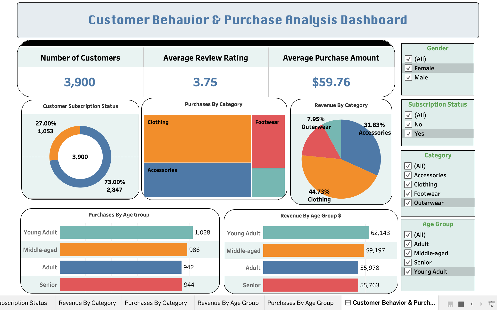

# Customer Shopping Behavior Analysis

## Overview
This project presents an end-to-end data analytics workflow to uncover key patterns in customer shopping behavior, spending habits, and demographic trends. By leveraging Python, MySQL, and Tableau, raw customer data was transformed into actionable business insights, culminating in an interactive dashboard and stakeholder-ready executive reports.

---

## Dataset
* **Source:** Customer Shopping Behavior Dataset
* **Description:** Contains records of customer transactions, demographics (age, gender), item categories, purchase amounts, subscription status, payment methods, and review ratings.

---

## Tech Stack & Tools Used
* **Python (Pandas, NumPy):** Data loading, Exploratory Data Analysis (EDA), missing value handling, and feature engineering.
* **MySQL Server:** Database schema creation, data insertion, and structured SQL querying for analytical insights.
* **Tableau Public:** Interactive data visualization and dashboard design.
* **Gamma:** AI-powered presentation design for executive slides.
* **PDF Report:** Comprehensive analytical documentation.

---

## Project Execution Steps
1. **Data Cleaning & Feature Engineering (Python):**
   * Handled missing values, standardized data types, and removed duplicates.
   * Created calculated metrics and custom categories to enhance analysis.
2. **Database & Analysis (MySQL):**
   * Imported cleaned data into MySQL Server.
   * Ran targeted SQL queries (aggregations, window functions, customer segmentation) to answer key business questions.
3. **Data Visualization (Tableau):**
   * Designed an interactive dashboard capturing high-level KPIs, customer demographics, and purchasing trends.
4. **Reporting & Presentation (Gamma & PDF):**
   * Compiled strategic insights into an executive PDF report and an automated presentation via Gamma.

---

## Interactive Dashboard
You can explore the interactive dashboard directly on Tableau Public:

👉 **[View Live Tableau Dashboard](https://public.tableau.com/views/CustomerBehaviorPurchaseAnalysisDashboard/CustomerBehaviorPurchaseAnalysisDashboard?:language=en-GB&:sid=&:redirect=auth&:display_count=n&:origin=viz_share_link)**

 -->

---

## Key Results & Insights
* **Top Revenue Segments:** Identified the most profitable customer age groups and product categories.
* **Purchase Drivers:** Discovered strong correlations between customer review ratings, subscription status, and repeat purchase frequency.
* **Payment Preferences:** Mapped preferred payment channels across different demographic groups to optimize checkout strategies.

---

## How to Run This Project

### Prerequisites
* Python 3.x
* MySQL Server & MySQL Workbench
* Tableau Desktop or Tableau Public account

### Repository Structure
```text
├── data/
│   ├── raw_data.csv
│   └── cleaned_data.csv
├── notebooks/
│   └── data_cleaning_eda.ipynb
├── sql/
│   └── customer_analysis_queries.sql
├── reports/
│   ├── Customer_Analysis_Report.pdf
│   └── Presentation_Slides.pdf
└── README.md
